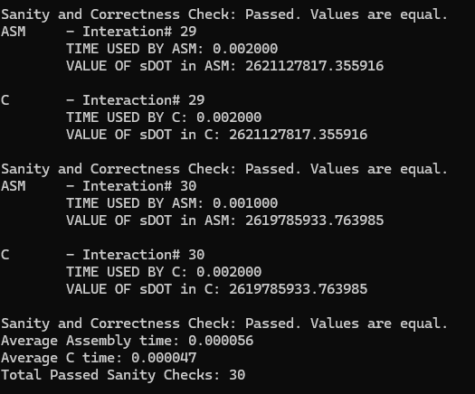
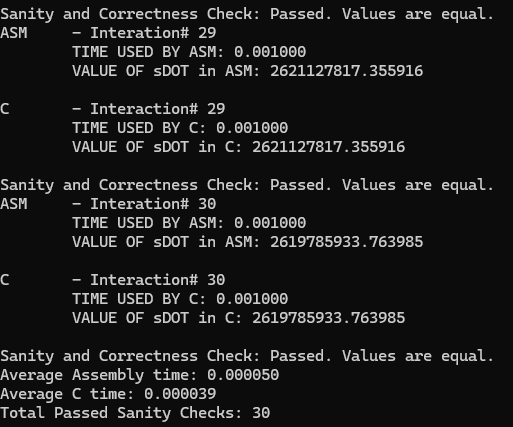

# LBYARCH_MP2
#### Salen, Rommel Kendric D.
#### Suba, Kaye Diosa Advincula
#### S12
LBYARCH Machine Project#2 

## DEBUG MODE:
### n = 2^20

```
ASM     - Interation# 30
        TIME USED BY ASM: 0.003000
        VALUE OF sDOT in ASM: 2619785933.763985

C       - Interaction# 30
        TIME USED BY C: 0.004000
        VALUE OF sDOT in C: 2619785933.763985

Sanity and Correctness Check: Passed. Values are equal.
Average Assembly time: 0.000059
Average C time: 0.000089
Total Passed Sanity Checks: 30
```

### n = 2^24

```
ASM     - Interation# 30
        TIME USED BY ASM: 0.019000
        VALUE OF sDOT in ASM: 41924465442.792923

C       - Interaction# 30
        TIME USED BY C: 0.046000
        VALUE OF sDOT in C: 41924465442.792923

Sanity and Correctness Check: Passed. Values are equal.
Average Assembly time: 0.000846
Average C time: 0.001424
Total Passed Sanity Checks: 30
```

### n = 2^27


```
ASM     - Interation# 30
        TIME USED BY ASM: 0.220000
        VALUE OF sDOT in ASM: 335528987346.854309

C       - Interaction# 30
        TIME USED BY C: 0.293000
        VALUE OF sDOT in C: 335528987346.854309

Sanity and Correctness Check: Passed. Values are equal.
Average Assembly time: 0.006960
Average C time: 0.010127
Total Passed Sanity Checks: 30
```

## RELEASE MODE
### n = 2^20

```
ASM     - Interation# 30
        TIME USED BY ASM: 0.002000
        VALUE OF sDOT in ASM: 2619785933.763985

C       - Interaction# 30
        TIME USED BY C: 0.002000
        VALUE OF sDOT in C: 2619785933.763985

Sanity and Correctness Check: Passed. Values are equal.
Average Assembly time: 0.000060
Average C time: 0.000053
Total Passed Sanity Checks: 30
```

### n = 2^24

```
ASM     - Interation# 30
        TIME USED BY ASM: 0.033000
        VALUE OF sDOT in ASM: 41924465442.792923

C       - Interaction# 30
        TIME USED BY C: 0.031000
        VALUE OF sDOT in C: 41924465442.792923

Sanity and Correctness Check: Passed. Values are equal.
Average Assembly time: 0.001024
Average C time: 0.000938
Total Passed Sanity Checks: 30
```

### n = 2^27

```
ASM     - Interation# 30
        TIME USED BY ASM: 0.267000
        VALUE OF sDOT in ASM: 335528987346.854309

C       - Interaction# 30
        TIME USED BY C: 0.213000
        VALUE OF sDOT in C: 335528987346.854309

Sanity and Correctness Check: Passed. Values are equal.
Average Assembly time: 0.012044
Average C time: 0.005294
Total Passed Sanity Checks: 30
```

# I.) Comparative Execution Time:
| [] | Debug, ASM | Debug, C | Release, ASM | Release, C |
|----------|----------|----------|----------|----------|
| 2^20   | 0.000059   | 0.000089   | 0.000060   | 0.000053   |
| 2^24 | 0.000846 | 0.001424 | 0.001024 | 0.000938 |
| 2^27   | 0.006960   | 0.010127   | 0.012044   | 0.005294   |

As can be seen above, both in Debug and Release, x86-64 is faster than C when the program is fairly in Debug Mode, but C is faster than x86-64 when the program is in Release Mode.

# II.) Screenshot with Correctness (C)



# III.) Screenshot with Correctness (ASM)



